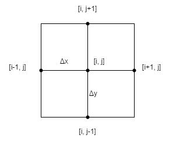

# 1. Solving the Navier-Stokes Equations Using the Finite Difference Method
Author: Simon Bland

Date: February 2025

# 2. Summary

This document outlines the theory behind using a finite difference method
to solve the Navier-Stokes equations and explains how it is implemented
in this project's code.

# 3. Table of Contents
- [1. Solving the Navier-Stokes Equations Using the Finite Difference Method](#1-solving-the-navier-stokes-equations-using-the-finite-difference-method)
- [2. Summary](#2-summary)
- [3. Table of Contents](#3-table-of-contents)
- [4. Navier-Stokes Equations](#4-navier-stokes-equations)
- [5. Finite Difference Method](#5-finite-difference-method)
  - [5.1. Setting Boundary Conditions](#51-setting-boundary-conditions)
  - [5.2. Temporal Discretization](#52-temporal-discretization)
  - [5.3. The SIMPLE Method](#53-the-simple-method)
  - [5.4. The Predictor Step](#54-the-predictor-step)
  - [5.5. The Pressure Poisson Equation](#55-the-pressure-poisson-equation)
  - [5.6. Neumann Boundary Condition Reset](#56-neumann-boundary-condition-reset)
  - [5.7. Corrector Step](#57-corrector-step)
- [6. Implementation and Coding](#6-implementation-and-coding)
- [7. Further Reading](#7-further-reading)


# 4. Navier-Stokes Equations
Starting with Newton's Second Law of motion and applying it to an incompressible fluid,
we can derive two equations that describe the motion of the fluid.
These are known as the Navier-Stokes equations and are descibed here in vector notation:

$$
\frac{\partial \textbf{u}}{\partial t} + \textbf{u}\cdot{\nabla}\textbf{u} = -{\frac{1}{\rho}}{\nabla}{p} + \nu{\nabla}^2\textbf{u} \qquad (1)
$$

$$
\nabla \cdot \textbf{u} = 0 \qquad (2)
$$

In this document we will only be dealing with two-dimensional fluid flow,
so in these and subsequent equations the variables we are using represent
**u** = [u, v], a two-dimensional velocity vector,
t is time,
$\rho$ is density,
p is pressure,
and $\nu$ is the kinematic viscosity.

# 5. Finite Difference Method

There are a mere handful of cases where we can obtain an exact solution for these equations,
and no general solution is known to exist.
However, there are several ways to solve them numerically,
each of which involves some amount of simplification or compromise.

One of the most widely used methods involves breaking up the domain into a grid
of evenly sized rectangular elements.
The solution is developed at the grid's nodes,
using the grid's geometry to approximate the derivatives of u and p.

The diagrammatic representation of the grid shown below is commonly referred to as a stencil.



On a stencil like this one we can then derive approximate expressions for derivatives as:

$$
 \frac{\partial u}{\partial x}_{i,j} \simeq  \frac {u_{i+1, j} - u_{i, j}}{\Delta x} 
$$

and second derivatives as:

$$
 \frac{\partial^2 u}{\partial x^2}_{i,j} \simeq  \frac {u_{i-1, j} - 2u_{i, j} + u_{i+1, j}}{\Delta x^2} 
$$

We do the same thing for other variables such as the vertical component of velocity and for pressure p.
It is obvious that the accuracy of this approximation increases as the grid becomes smaller.

While these approximations are straightforward,
the Navier-Stokes equations are non-linear in $\mathbf u$.
They cannot be solved directly using an $A \mathbf x = b$ type solver.

Instead, we must solve them iteratively. 

## 5.1. Setting Boundary Conditions

The solution begins by setting Dirichlet conditions at the domain boundary.
These are fixed values for the u and v components of **u**, and p, 
which will remain unchanged in the subsequent calculations.

In this project's code,
u and v are set everywhere to 0 except on the cavity lid nodes where
u is set to the chosen lid velocity.

We set a nominal initial value for p = 0 eveywhere except on the cavity lid nodes where
we set p = 1.

## 5.2. Temporal Discretization

After setting Dirichlet conditions,
we start to propogate velocity and pressure through the domain in steps of time until they (hopefully) become stable in value.

At the nth timestep we have:

$$
\frac{\mathbf{u}^{n+1}-\mathbf{u}^n}{\Delta t}=-\frac{1}{\rho}\nabla p^{n+1} - \mathbf{u}^n \cdot \nabla \mathbf{u}^n + \nu \nabla ^2 \mathbf{u}^n
$$

Which can be rewritten as:

$$
\mathbf{u}^{n+1}=\left( -\frac{1}{\rho}\nabla p^{n+1}  - \mathbf{u}^n \cdot \nabla \mathbf{u}^n + \nu \nabla ^2 \mathbf{u}^n \right)\Delta t + \mathbf{u}^n \qquad (3)
$$

## 5.3. The SIMPLE Method

Equation (1) represents the conservation of momentum.
Equation (2) represents mass conservation at constant density.

There is no pressure term in the incompressible continuity equation (2) to provide a relation between velocity and pressure
(in contrast, in compressible flow the mass continuity provides an equation for the density $\rho$,
which we use along with an equation of state to relate density and pressure). 

The workaround is to use a predictor-corrector method which first solves for velocity in the absence of pressure,
then correct for pressure in a second step.

## 5.4. The Predictor Step

Dropping the pressure term from equation 3 and rewriting $\mathbf{u}^{n+1}$ as $\mathbf{u}^*$ gives the predictor equation:

$$
\mathbf{u}^*=\left(- \mathbf{u}^n \cdot \nabla \mathbf{u}^n + \nu \nabla ^2 \mathbf{u}^n \right)\Delta t + \mathbf{u}^n \qquad (3)
$$

Where:

$$
\frac{\mathbf{u}^{n+1}-\mathbf{u}^*}{\Delta t}=-\frac{1}{\rho}\nabla p^{n+1} \qquad (4)
$$

## 5.5. The Pressure Poisson Equation

We can then separately solve for $\mathbf{u}^*$:

$$
\nabla \big( \frac{\mathbf{u}^{n+1}-\mathbf{u}^*}{\Delta t} \big)=-\nabla \big(\frac{1}{\rho}\nabla p^{n+1}\big)
$$

By continuity:

$$
\nabla \cdot \mathbf{u}^{n+1} = 0
$$

Therefore:

$$
\nabla ^2 p^{n+1} = \frac{\rho}{\Delta t} \nabla \cdot \mathbf{u}^* \qquad (5)
$$

Equation (5) is known as the Pressure Poisson equation. 
Using the values for $\mathbf u^*$ from (3), it is now possible to either solve it directly using matrix algebra,
[ref 2],
or derive an equation for $p_{i, j}^{n+1}$ [ref 1]

## 5.6. Neumann Boundary Condition Reset

Before proceeding to the next timestep, we set Neumann boundary conditions.
The derivatives $\frac{\partial p}{\partial x}$ at the left and right boundary and
$\frac{\partial p}{\partial y}$ at the bottom boundary are set to 0.
We do this by changing the value of p at the adjacent nodes to match those at the boundary nodes.

## 5.7. Corrector Step

With the value for p now at hand, we substitute for p into equation (4) which we rewrite as:

$$
\mathbf{u}^{n+1}=\Delta t\left( - \frac{1}{\rho}  \nabla p^{n+1}\right) + \mathbf{u}^*  \qquad (6)
$$

Then proceed to the next timestep.

# 6. Implementation and Coding

Switching from vector notation to writing out the differentials in full
makes the transition to code easier to understand.

The initialization of arrays and other variables in the code is documented
through the comments and should be easy to follow.

We do some pre-calculation in the code to make computations less expensive.
For example, constants and variables used in division are inverted
to enable multiplication instead.

In C#:
```

var rhoi = 1 / rho;

```

also:

```

var dx2 = dx * dx;
var dy2 = dy * dy;
var dxi = 1 / dx;
var dyi = 1 / dy;
var dxi2 = dxi * dxi;
var dyi2 = dyi * dyi;
var dxy2i = 1 / (dx2 + dy2);

```

In the time loop, the calculation for $\mathbf u^*$ in (3) is done by calculating
each vector component separately in parallel: 

$$
u^{*n+1} = \left( \nu \left(\frac{\partial^2 u^n}{\partial^2 x} + \frac{\partial^2 u^n}{\partial^2 y}\right)    -\left( u^n \frac{\partial u^n}{\partial x}+ v^n\frac{\partial u^n}{\partial y} \right)  \right) \Delta t + u^n
$$

In C#:

```

uStar[i, j] = u[i, j] +
              dt * (nu * (u[i - 1, j] - 2 * u[i, j] + u[i + 1, j]) * dxi2 +
                    nu * (u[i, j - 1] - 2 * u[i, j] + u[i, j + 1]) * dyi2 -
                    0.5 * u[i, j] * (u[i + 1, j] - u[i - 1, j]) * dxi -
                    0.5 * v[i, j] * (u[i, j + 1] - u[i, j - 1]) * dyi);

```
and:

$$
v^{*n+1} = \left( \nu \left(\frac{\partial^2 v^n}{\partial^2 x} + \frac{\partial^2 v^n}{\partial^2 y}\right)   -\left( u^n \frac{\partial v^n}{\partial x}+ v^n\frac{\partial v^n}{\partial y} \right)  \right) \Delta t + v^n
$$

In C#:

```

vStar[i, j] = v[i, j] +
              dt * (nu * (v[i - 1, j] - 2 * v[i, j] + v[i + 1, j]) * dxi2 +
                    nu * (v[i, j - 1] - 2 * v[i, j] + v[i, j + 1]) * dyi2 -
                    0.5 * u[i, j] * (v[i + 1, j] - v[i - 1, j]) * dxi -
                     0.5 * v[i, j] * (v[i, j + 1] - v[i, j - 1]) * dyi);

```
The right hand side of the Pressure Poisson equation (5) is then calculated as:

$$
b = \frac{\rho}{\Delta t} \left( \frac{\partial u^*}{\partial x} + \frac{\partial v^*}{\partial y} \right)
$$

In C#:

```

b[i, j] = rho * ((uStar[i + 1, j] - uStar[i - 1, j]) * 0.5 * dxi + (vStar[i, j + 1] - vStar[i, j - 1]) * 0.5 * dyi) / dt;

```
The left hand side can then be written as:

$$
\frac{\partial ^2 p^{n+1}}{\Delta x^2}+ \frac{\partial ^2 p^{n+1}}{\Delta y^2} = b
$$

$$
\frac{p^{n+1}(i-1,j) - 2p^{n+1}(i,j) + p^{n+1}(i+1,j)}{\Delta x^2}+ \frac{p^{n+1}(i-1,j) - 2p^{n+1}(i,j) + p^{n+1}(i+1,j)}{\Delta y^2} = b
$$

$$
\frac{\left(p^{n+1}(i-1,j) - 2p^{n+1}(i,j) + p^{n+1}(i+1,j)\right) \Delta y^2 + \left( p^{n+1}(i-1,j) - 2p^{n+1}(i,j) + p^{n+1}(i+1,j) \right) \Delta x^2}{\Delta x^2 \Delta y^2} = b
$$

$$
\left(p^{n+1}(i-1,j) - 2p^{n+1}(i,j) + p^{n+1}(i+1,j)\right) \Delta y^2 + \left( p^{n+1}(i-1,j) - 2p^{n+1}(i,j) + p^{n+1}(i+1,j) \right) \Delta x^2 = b^n(i,j) \Delta x^2 \Delta y^2
$$

$$
p^{n+1}(i-1,j)\Delta y^2 - 2p^{n+1}(i,j)\Delta y^2 + p^{n+1}(i+1,j)\Delta y^2  + p^{n+1}(i-1,j)\Delta x^2 - 2p^{n+1}(i,j)\Delta x^2 + p^{n+1}(i+1,j)\Delta x^2   = b^n(i,j) \Delta x^2 \Delta y^2
$$

$$
 - 2\left( \Delta y^2 + \Delta x^2 \right) p^{n+1}(i,j)    = - \Delta y^2 \left(p^{n+1}(i-1,j) + p^{n+1}(i+1,j) \right) - \Delta x^2 \left( p^{n+1}(i-1,j) + p^{n+1}(i+1,j) \right) + b^n(i,j) \Delta x^2 \Delta y^2
$$

Finally giving:

$$
p^{n+1}(i,j)    = \frac{\Delta y^2 \left(p^{n+1}(i-1,j) + p^{n+1}(i+1,j) \right) + \Delta x^2 \left( p^{n+1}(i-1,j) + p^{n+1}(i+1,j) \right) - b^n(i,j) \Delta x^2 \Delta y^2}{2\left( \Delta y^2 + \Delta x^2 \right) }
$$

In the code, we clone the pressure array for a clear distinction between $p^{n}$ and $p^{n+1}$.

In C#:
```

double[,] pn = (double[,])p.Clone();

```

Then solve for $p^{n+1}$.

In C#:
```

p[i, j] = ((pn[i + 1, j] + pn[i - 1, j]) * dy2 + (pn[i, j + 1] + pn[i, j - 1]) * dx2 - b[i, j] * dx2 * dy2) * 0.5 * dxy2i;

```

The pressure correction step (6) is then:

$$u^{n+1}=-\frac{\Delta t}{\rho}\left(\frac{\partial p^{n+1}}{\partial x} \right) + u^*$$
$$v^{n+1}=-\frac{\Delta t}{\rho}\left( \frac{\partial p^{n+1}}{\partial y}\right) + v^*$$

In C#:

```

u[i, j] = uStar[i, j] - (p[i + 1, j] - p[i - 1, j]) * 0.5 * dxi * dt * rhoi;
v[i, j] = vStar[i, j] - (p[i, j + 1] - p[i, j - 1]) * 0.5 * dyi * dt * rhoi;

```

# 7. Further Reading

Most of the coding in this project was derived by working though the algorithms discussed by Alvarez and Nobe [1].
I have followed their methodology,
particularly in using central differencing throughout and simplifying the treatment of the pressure calculation and setting of boundary conditions

I first became interested in developing this project by reading and working through Owkes [2] and then working though the steps provided by Lorena Barba [3].
Reading all three of these texts in conjunction and writing code of your own is highly recommended.
1. [Alvarez and Nobe](https://colab.research.google.com/github/josealvarez97/The-Ultimate-Guide-to-Write-Your-First-CFD-Solver/blob/main/The_Ultimate_Guide_to_Write_Your_First_CFD_Solver.ipynb)
2. [Owkes](https://www.montana.edu/mowkes/research/source-codes/GuideToCFD.pdf)
3. [Barba et al.](https://github.com/barbagroup/CFDPython/blob/master/lessons/14_Step_11.ipynb)
